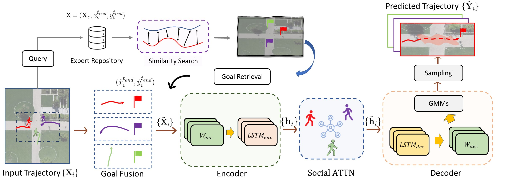

# ICCV 2021: Where are you heading? Dynamic Trajectory Prediction with Expert Goal Examples

This repository contains the code for the paper **[Where are you heading? Dynamic Trajectory Prediction with Expert Goal
Examples]()**. Accepted to [ICCV 2021](http://iccv2021.thecvf.com/home)

**Abstract**: Goal-conditioned approaches recently have been found very useful to human trajectory prediction, when adequate goal estimates are provided. Yet, goal inference is difficult in itself and often incurs extra learning effort. We propose to predict pedestrian trajectories via the guidance of goal expertise, which can be obtained with modest expense through a novel goal-search mechanism on already seen training examples. There are three key contributions in our study. First, we devise a framework that exploits nearest examples for high-quality goal position inquiry. This approach naturally considers multi-modality, physical constraints, compatibility with existing methods and is nonparametric; it therefore does not require additional learning effort typical in goal inference. Second, we present an end-to-end trajectory predictor that can efficiently associate goal retrievals to past motion information and dynamically infer possible future trajectories. Third, with these two novel techniques in hand, we conduct a series of experiments on two broadly explored datasets (SDD and ETH/UCY) and show that our approach surpasses previous state-of-the-art performance by notable margins and reduces the need for additional parameters

## Model

<!-- Our model consists of two sequential steps: an endpoint prediction module and a social pooling module. The endpoint prediction module is a CVAE which models the desired end destination of a pedestrian as a representation of its past observed trajectories. The social pooling module considers the past history of all the pedestrians in the scene and their predicted endpoints from the endpoint module to predict socially compliant future trajectories. -->

<div align='center'>
  </img>
</div>

<!-- ## Setup -->

<!-- All code was developed and tested on Ubuntu 16.04.6 with Python 3.6.6 and PyTorch 1.4.0 with CUDA 10.0. -->

<!-- ## Pretrained Models -->

<!-- Pretrained models are available in the `saved_models` folder. -->

<!-- ## Configuration File -->

<!-- Configuration files (or config files) are used to load parameters such as hidden layer dimensions or learning rates into a model to be trained. To do this, first edit any of the parameters in the contents dictionary in config_gen.py in the config folder. Next, run config_gen.py using the following commands: -->

<!-- ```bash -->
<!-- # Start in the project root directory -->
<!-- cd config -->
<!-- python config_gen.py -fn <config_save_name> -->
<!-- ``` -->

<!-- where config_save_name is the name that the config file should be saved with ending in .yaml. -->

## Result

| **SDD**                           | **ADE** | **FDE** |
| --------------------------------- | ------- | ------- |
| **Eval-Opt1** (Reported in Paper) | 7.69    | 14.38   |
| **Eval-Opt2**                     | 7.51    | 13.21   |

## *Update (03/28/2022)
As pointed out by others that our reported results might not be directly comparable with parallel works. We provide a modified version of our results for all datasets using the mean value of predicted GMM2d (i.e. gmm2d.mus) as follow 
| **Dataset**                           | **ADE** | **FDE** |
| --------------------------------- | ------- | ------- |
| **SDD**  | 10.49    | 13.21   |
| **ETH**                     | 0.3662    | 0.6516   |
| **HOTEL**                     | 0.1076    | 0.1474   |
| **ZARA1**                     | 0.1511   | 0.3106   |
| **ZARA2**                     |  0.1160   |  0.2554  |
| **UNIV**                     |  0.2017   | 0.4365   |

In this way, our model only retreieve 20 destinations (**w/o** sampling anything from learned models), select the best one and fill-in the midway trajectories **deterministically** (This is really not our point but more comparable).


## Running Pre-trained Models

You can run the command for SDD:

```bash
python test_sdd.py
```

You can run the command for ETH/UCY:

```bash
python test_ethucy.py
```

To switch subsets among the ETH/UCY, change the **dataset_name** variable in test_ethucy.py file (e.g., eth/zara1/zara2/hotel/univ)

## Citation

If you find this code useful in your work then please cite

```bibtex
@inproceedings{he2021where,
  title={Where are you heading? Dynamic Trajectory Prediction with Expert Goal Examples},
  author={He, Zhao and Richard P. Wildes},
  booktitle = {Proceedings of the International Conference on Computer Vision (ICCV)},
  month = {Oct.},
  year={2021}
}
```

## Acknowledgement

The dataset processing is largely from [PECNET](https://github.com/HarshayuGirase/PECNet) and [Social-STGCNN](https://github.com/abduallahmohamed/Social-STGCNN). Many thanks to them.

## Contact

Please contact He Zhao @ zhufl@eecs.yorku.ca if any issue.
